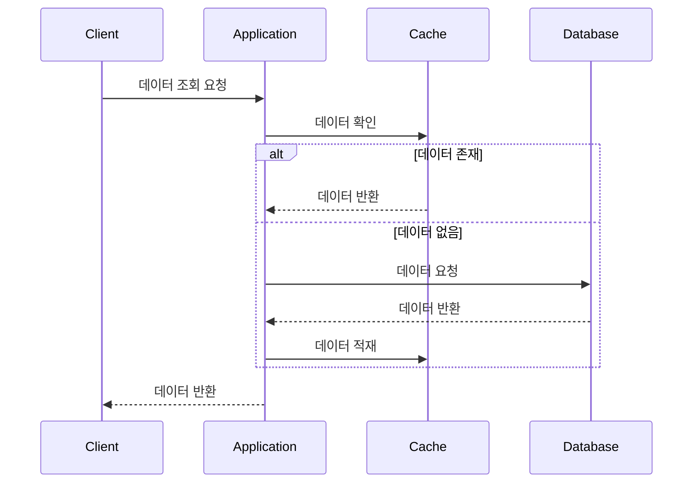
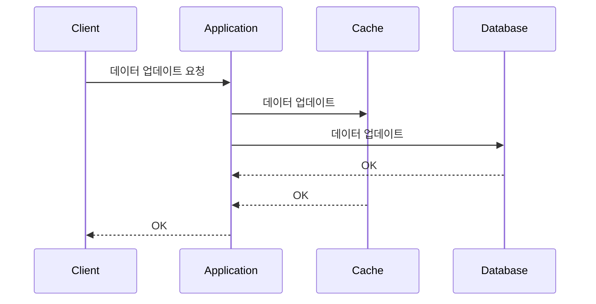
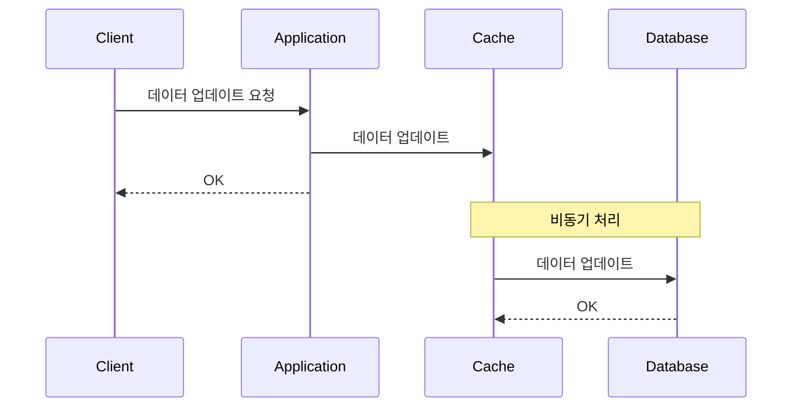
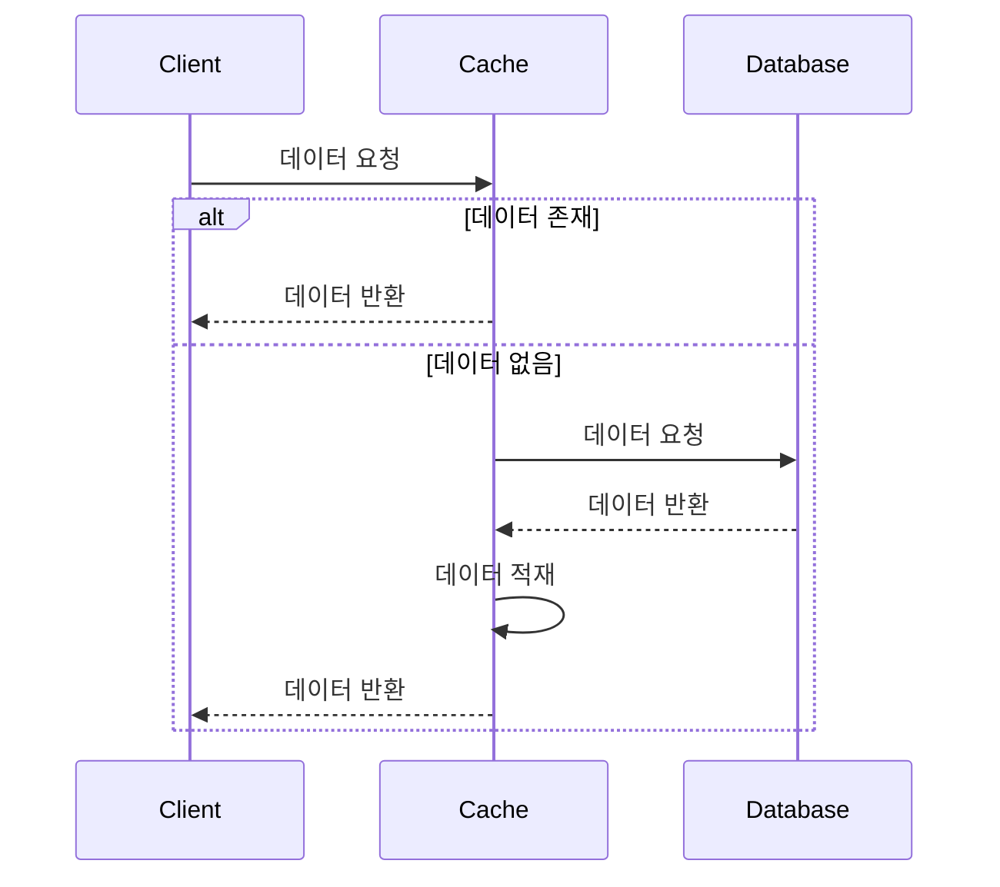

# 캐시 전략 패턴 비교 분석

본 문서는 캐싱에 사용되는 4가지 주요 전략 패턴에 대해 비교 분석합니다.

---

## 1. 캐시 전략 패턴 4가지 비교 분석

### 1.1. Cache Aside 패턴

- **개념**:  
  애플리케이션이 먼저 캐시에서 데이터를 조회하고, 캐시 미스 시 데이터베이스에서 데이터를 가져와 캐시에 저장한 후 반환하는 방식.
- **장점**:
    - 구현이 간단함.
    - 데이터 조회가 많을 경우 데이터베이스 부하를 효과적으로 줄일 수 있음.
- **단점**:
    - 캐시 미스 시 첫 요청에 대한 응답 시간이 길어질 수 있음.
    - 데이터 일관성 유지에 추가적인 고려가 필요함.

**시퀀스 다이어그램**:

### 1.2. Write Through 패턴

- **개념**:  
  쓰기 작업 시 캐시와 데이터베이스를 동시에 업데이트하여, 양쪽의 데이터 일관성을 유지하는 방식.
- **장점**:
    - 데이터 일관성이 실시간으로 유지됨.
- **단점**:
    - 쓰기 작업의 응답 시간이 증가할 수 있음.
    - 트랜잭션 관리가 복잡해질 수 있음.

**시퀀스 다이어그램**:

### 1.3. Write Back 패턴

- **개념**:  
  쓰기 작업 시 우선 캐시에 데이터를 기록한 후, 일정 주기나 조건에 따라 비동기적으로 데이터베이스에 업데이트하는 방식.
- **장점**:
    - 쓰기 작업의 응답 속도가 향상됨.
    - 데이터베이스에 대한 쓰기 부하가 감소함.
- **단점**:
    - 캐시와 데이터베이스 간의 데이터 불일치(일관성) 문제가 발생할 수 있음.
    - 장애 발생 시 데이터 손실 위험이 존재함.

**시퀀스 다이어그램**:

### 1.4. Read Through 패턴

- **개념**:  
  캐시에서 데이터를 읽으며, 캐시 미스 시 캐시 자체가 데이터베이스에서 데이터를 조회하여 캐시에 업데이트한 후 반환하는 방식.
- **장점**:
    - 개발자가 별도의 캐시 관리 코드를 작성할 필요가 없어 구현이 간편함.
    - 데이터 조회 시 성능 향상을 기대할 수 있음.
- **단점**:
    - 캐시 미스 시 조회 지연이 발생할 수 있음.
    - 캐시 로직이 내부에 포함되어 있어 관리가 복잡해질 수 있음.

**시퀀스 다이어그램**:

