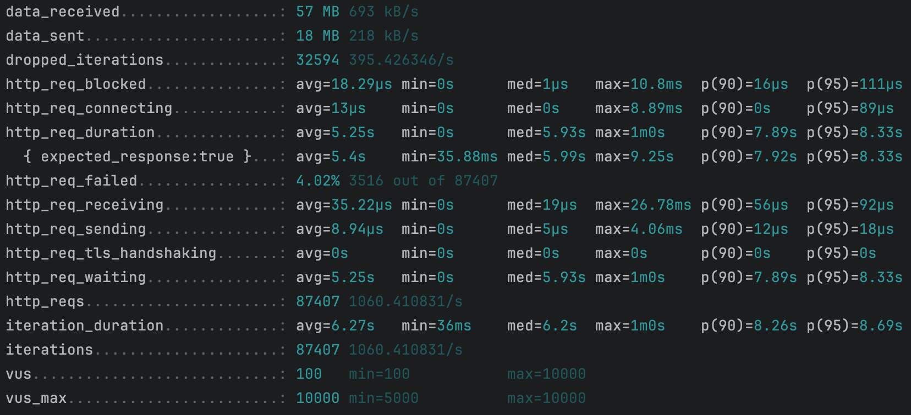

# 캐시 도입 보고서

본 보고서는 콘서트 예약 시스템에서 콘서트 목록 조회 기능에 캐시를 적용한 사례를 분석하고, 기존 시스템(AS-IS)과 개선 시스템을 비교하여 캐시의 구현 과정을 도출하고자 작성되었습니다.

---

## 1. 배경

콘서트 예약 시스템은 많은 사용자가 동시에 접속하는 환경에서 빠른 응답과 안정적인 서비스를 제공해야 합니다.  
이를 위해 데이터베이스(DB)에 과부하가 걸리지 않도록 다양한 트래픽 제어 기법이 적용되고 있으며, 대기열(큐)을 통한 제어 방식이 주로 활용되고 있습니다.

---

## 2. 문제 제기

- **트래픽 집중 시 부하 문제**:  
  기존 시스템은 대기열을 통해 일정 수준의 트래픽 제어가 가능하지만, 급격한 트래픽 증가 시 DB 부하가 우려되는 문제가 있습니다.

- **캐싱 전략 선택의 필요성**:  
  상황에 맞는 적절한 캐싱 패턴을 선택하여 적용함으로써, 유지보수성과 시스템 안정성을 고려할 필요가 있습니다.

---

## 3. AS-IS: 기존 시스템 분석

- **구조 및 현황**:
    - 사용자 요청 → 대기열(큐) 처리 → **페이징 기반 콘서트 목록 조회** → DB 응답
    - 기존 콘서트 목록 조회 API는 캐시 적용이 되어있지 않아 매 요청 시마다 DB 접근을 통해 데이터를 조회합니다.

- **문제점**:
    - **페이징 방식의 한계**:  
      각 페이지 및 사이즈에 따른 캐싱 전략을 고려해야 하므로 캐싱 적용에 어려움이 있습니다.
    - **부하 집중**:  
      대기열을 통한 제어에도 불구하고, 특정 시점에 다수의 페이지 요청이 몰릴 경우 DB에 과도한 부하가 발생할 수 있습니다.

---

## 4. 구현 및 적용 현황

### 4.1. 구현 개요

기존 페이징 기반 조회의 한계를 극복하기 위하여,  
**인기 콘서트 TOP 20 조회 API**를 기획 및 구현하고, 해당 API에 캐시를 적용하였습니다.  
이 API는 사용자에게 최초로 보여지는 데이터로서 접근 빈도가 높고, 실시간성이 크지 않아 캐시 적용에 적합하다고 판단하였습니다.

- **적용된 캐싱 전략**:  
  인기 콘서트 TOP 20 조회 API에는 **Cache Aside 패턴**을 적용하였습니다.  
  해당 패턴을 선택한 이유는 이미 대기열을 통한 부하 분산 효과가 있었기 때문에 캐시스탬피드 현상을 크게 고려하지 않아도 되었고, Spring의 Annotation(@Cacheable 등)을 활용하여 간단하게
  구현할 수 있었기 때문입니다.

- **캐시 구현 방식**:  
  인기 콘서트 TOP 20 조회 API에는 분산 환경에서 데이터 일관성을 보장하기 위해 **Redis 캐시**가 적용되었습니다.

- **운영 효과**:
    - 사용자에게 빠른 응답을 제공할 수 있습니다.
    - DB 부하가 효과적으로 감소하는 긍정적인 결과를 확인할 수 있습니다.

---

## 5. 캐시 전략 패턴 비교 분석

캐시 전략 패턴에 대한 자세한 설명은 별도의 문서에서 확인하실 수 있습니다.  
자세한 내용은 [캐시 패턴 비교 분석](caching-pattern.md) 페이지를 참고하시기 바랍니다.

---

## 6. AS-IS와 구현 시스템에 대한 비교 분석

| 구분         | AS-IS (기존 시스템)               | 구현 시스템 (개선 적용 후)                      |
|------------|------------------------------|---------------------------------------|
| **최초 진입점** | 페이징 기반 콘서트 목록 조회             | 인기 콘서트 TOP 20 조회                      |
| **DB 부하**  | API 요청 시 매번 DB 접근으로 DB 부하 증가 | 캐시에 데이터가 존재하는 경우 DB에 접근하지 않아 DB 부하 감소 |
| **구현 복잡성** | DB 조회가 유일하여 구조가 단순함          | 캐싱 적용 및 Redis 캐시 도입으로 인해 시스템이 다소 복잡함  |

- **분석 결과**:  
  기존 시스템은 페이징 방식으로 인해 각 페이지마다 DB 접근이 빈번하여 부하가 발생하는 한계가 있었습니다.  
  구현된 개선 시스템은 **인기 콘서트 TOP 20 조회** API에 Cache Aside 패턴과 Redis 캐시를 적용함으로써, 사용자 응답 속도 향상과 DB 부하 감소 효과를 얻었습니다.

---

## 7. 성능 테스트 및 결과 분석

캐시 도입 전후의 성능을 비교하기 위해 **k6 부하 테스트** 도구를 활용하여 API 성능 테스트 및 DB 부하 테스트를 수행하였습니다.

### 7.1. 테스트 환경

테스트 환경은 다음과 같습니다:

- **DB 환경**: MySQL 8.0
    - CPU 제한: 1 vCPU
    - 메모리 제한: 1024MB
- **캐시 환경**: Redis
    - CPU 제한: 1 vCPU
    - 메모리 제한: 1024MB
- **API 요청 환경**:
    - 초당 2000개의 요청 (RPS 2000)
    - 1분 동안 지속적 부하 테스트
    - 최대 가용 Virtual Users (VUs): 10,000
- **테스트 대상 API**:
    - 캐시 적용 X API: (`/api/v1/concerts?page=1&size=10`)
    - 캐시 적용 O API: (`/api/v1/reservations/concert/popular`)

### 7.2. 성능 테스트 결과

#### 캐시 적용 전 (AS-IS)

#### 캐시 적용 후 (TO-BE)

#### 성능 비교 결과

| 구분           | 캐시 적용 전 (AS-IS) | 캐시 적용 후 (TO-BE) |
|:-------------|-----------------|-----------------|
| 최대 QPS       | **15.0K**       | **4.86K**       |
| API 평균 응답 속도 | **5.25s**       | **8.74ms**      |
| API 실패율      | **4.02%**       | **0%**          |

### 7.3. 성능 비교 분석

- **DB 부하 감소 효과**:
    - 기존 시스템에서 **15.0K**QPS 요청을 받던 것이 캐시 적용 후 **4.86K**QPS로 감소하였으며, **67%의 부하 감소**가 확인되었습니다.
    - API 요청이 캐시를 활용하면서 데이터베이스 접근 빈도가 줄어들었고, 이에 따라 전체적인 응답 속도가 단축되었습니다.

- **API 요청 실패율 감소**:
    - 기존에는 부하 상황에서 **4.02%의 요청 실패율**이 발생하였으나, 캐시 적용 후 **0%로 감소**하여 API의 안정성이 크게 개선되었습니다.

### 7.4. 결론

본 테스트를 통해 **Redis 캐시 적용이 API 성능 개선에 큰 영향을 미친 것**을 확인할 수 있었습니다.
DB 부하 감소, API 응답 속도 개선, 요청 실패율 감소 등의 성과를 바탕으로, 향후 더욱 안정적인 운영이 가능할 것으로 기대됩니다.

## 8. 한계점

- **데이터 신선도 관리**:  
  캐시 적용으로 실시간 데이터와의 차이가 발생할 수 있으므로, 데이터 갱신 주기 및 동기화 전략에 대해 지속적인 모니터링이 필요합니다.

- **캐시스탬피드 현상**:  
  캐시 만료 시 다수의 요청이 동시에 DB에 전달될 위험이 있어, 락 적용이나 랜덤 TTL 등의 기법을 통해 이를 예방할 필요가 있습니다.

- **분산 환경에서의 복잡성**:  
  Redis 캐시를 통한 분산 환경에서는 네트워크 지연이나 추가 인프라 관리 부담이 발생할 수 있으므로, 이에 대한 지속적인 관리가 요구됩니다.

- **구현 복잡성 증가**:  
  단일 캐싱 패턴(Cache Aside) 도입 및 Redis 캐시 활용으로 인해 시스템 구현 및 유지보수 측면에서 일부 복잡성이 증가하였음을 확인하였습니다.

---

## 9. 결론

본 보고서에서는 기존 시스템의 페이징 기반 조회 방식에서 발생하던 DB 부하 문제를 해소하기 위해,  
**인기 콘서트 TOP 20 조회** API를 구현하고 Cache Aside 패턴과 Redis 캐시를 적용한 구현 사례를 보고드렸습니다.  
이를 통해 사용자에게 빠른 응답을 제공하고, DB 부하를 효과적으로 감소시킬 수 있음을 확인하였습니다.  
향후 운영 시 데이터 신선도 관리, 캐시스탬피드 대응 등 추가적인 관리 사항에 대해 지속적인 모니터링과 개선이 필요할 수 있습니다.