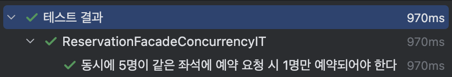
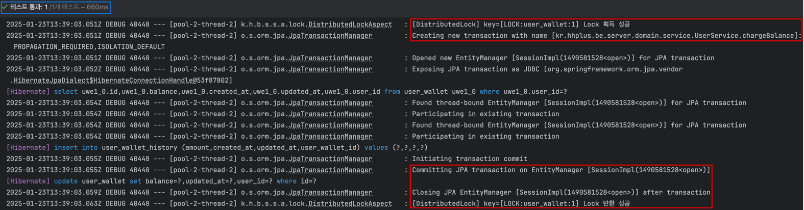

# 동시성 제어 방식 비교 및 적용 사례 분석

## 동시성 제어를 해야 하는 이유

### Race Condition

Race Condition(경쟁 조건)은 여러 프로세스나 스레드가 동시에 동일한 자원에 접근하여 예상치 못한 결과를 초래하는 상황을 말합니다.  
예를 들어, 두 사용자가 같은 좌석을 예약하기 위해 동시에 요청하는 경우 예상치 못하게 중복 예약이 발생하는 경우가 있을 수 있습니다.

### 프로젝트에서 발생 가능한 동시성 이슈

우리 프로젝트 "콘서트 예약 서비스"에서는 다음과 같은 기능에서 동시성 이슈가 발생할 수 있습니다.

#### 좌석 선점(예약)

좌석 예약 시, 동일한 좌석에 대해 여러 사용자가 동시에 예약을 시도하는 경우 중복 예약이 발생할 수 있습니다.

#### 사용자 잔액 충전/사용

사용자의 잔액을 충전하거나 사용할 때, 여러 트랜잭션이 동시에 실행될 경우 잔액이 올바르게 반영되지 않을 수 있습니다.

## 동시성 제어 방식 비교

프로젝트에서 동시성 제어를 위해서 아래와 같은 방식을 적용할 수 있습니다.

### 낙관적 락

- **장점**
    - **높은 성능**: 데이터베이스 락을 최소화하고 Application 레벨에서 제어하여 동시 접근 시에도 성능 저하가 적음.
- **단점**
    - **충돌 시 재시도 필요**: 데이터 충돌이 발생하면 예외를 던지고 필요시 재시도 로직을 구현해야 함.
    - **구현 복잡도 증가**: 버전 관리 컬럼 및 예외 처리 로직이 필요하여 구현 복잡도가 증가함.

### 비관적 락

- **장점**
    - **데이터 일관성 보장**: 락을 통해 충돌을 사전에 방지하여 데이터 일관성을 보장함.
    - **간단한 구현**: 락을 설정하는 것만으로 일관성을 유지할 수 있어 구현이 비교적 간단함.
- **단점**
    - **성능 저하**: 데이터베이스 락으로 인해 트랜잭션이 대기하게 되어 성능이 저하될 수 있음.
    - **락 경합**: 다수의 트랜잭션이 동시에 접근할 경우 락 경합이 발생하여 대기 시간이 증가.

### Redis 분산 락

- **장점**
    - **DB 부하 감소**: 데이터베이스에 락을 요청하지 않으므로 DB 부하가 줄어듦.
    - **유연한 락 관리**: DB 구조에 구애받지 않고 Key 기반으로 유연하게 락을 적용할 수 있음.
- **단점**
    - **추가 인프라 필요**: Redis 서버를 운영해야 하므로 인프라 비용과 관리가 필요.
    - **네트워크 의존성**: Redis와의 네트워크 연결에 의존하여 네트워크 장애 시 락 관리가 복잡해질 수 있음.

## 프로젝트에서 각 기능의 동시성 제어 방식

### 좌석 선점(예약)

좌석 선점(예약) 기능에서는 낙관적 락을 통해 동시성 제어를 수행합니다.

- 좌석 선점(예약) 기능에서는 동일 좌석에 대해 한 번만 성공하도록 보장해야 합니다.
- 낙관적 락은 여러 요청이 동시에 접근했을 때 하나의 요청만 성공하고 나머지 요청은 실패하여 예외가 발생하기 때문에, 해당 정책을 구현하기에 적합합니다.
    - 이러한 경우 DB 자체에 락이 발생하지 않아 성능 상 이점이 있고, 재시도 로직 없이 간단하게 구현이 가능합니다.

#### 테스트

- 동시성 테스트 : [ReservationFacadeConcurrencyIT](https://github.com/psh10066/hhplus-server-concert/blob/d563ff73dcc4c3855f8923d3666e917c39462253/src/test/java/kr/hhplus/be/server/application/ReservationFacadeConcurrencyIT.kt)
- 테스트 구현 의도 : 동일한 좌석에 여러 사용자가 예약을 시도하는 경우 1명만 성공함을 보장  
  

#### 세부 구현

1. `ConcertSeatEntity` 클래스의 `version` 컬럼에 `@Version` 어노테이션을 추가하여 낙관적 락 적용
2. `saveAndFlush` 메서드를 통해 DB에 반영할 때 경합을 체크하고, 예외 발생 시 "이미 예약된 좌석입니다." 예외를 발생시키도록 구현

#### `saveAndFlush` 메서드 사용 이유

단순히 `save` 메서드를 사용하는 경우 영속성 컨텍스트가 트랜잭션의 커밋 시점에 쿼리를 호출하기 때문에 아래와 같은 문제가 발생할 수 있습니다.

1. 충돌 시 수행될 필요 없는 이후 로직도 다 수행되고 나서 예외가 발생하여 성능 저하가 발생할 수 있습니다. 이를 `saveAndFlush` 메서드를 통해 즉시 데이터베이스에 update 쿼리를 호출하도록 구현하여 경합이 발생한 경우 바로 예외를 발생시킬 수 있습니다.
    - 아래는 `save` 메서드와 `saveAndFlush` 메서드를 사용했을 때 [ReservationFacadeConcurrencyIT](https://github.com/psh10066/hhplus-server-concert/blob/d563ff73dcc4c3855f8923d3666e917c39462253/src/test/java/kr/hhplus/be/server/application/ReservationFacadeConcurrencyIT.kt) 테스트의 쿼리 수행 결과 비교입니다.
        - `save` 메서드 사용 시 아래 이미지와 같이 충돌 시 수행될 필요 없는 이후 로직(파란색 박스)이 수행된 이후 버전 체크 로직(빨간색 박스)이 수행됨을 확인할 수 있습니다.
          
        - `saveAndFlush` 메서드 사용 시 아래 이미지와 같이 버전 체크 로직(빨간색 박스)이 먼저 수행된 후 충돌이 발생하지 않은 경우에 한하여 이후 로직(파란색 박스)이 수행됨을 확인할 수 있습니다.
          
2. 낙관적 락을 수행하는 메서드 내에서 예외 처리를 수행할 수 없습니다.
    - 아래는 [ConcertService](https://github.com/psh10066/hhplus-server-concert/blob/4b2343930542ad90b443de64d619be659b33fb95/src/main/kotlin/kr/hhplus/be/server/domain/service/ConcertService.kt) 클래스의 `reserveSeat` 메서드 내에서 save 부분에 try/catch 예외 처리가 되어있는 상황에서 `save` 메서드와 `saveAndFlush` 메서드를 사용했을 때 [ReservationFacadeConcurrencyIT](https://github.com/psh10066/hhplus-server-concert/blob/d563ff73dcc4c3855f8923d3666e917c39462253/src/test/java/kr/hhplus/be/server/application/ReservationFacadeConcurrencyIT.kt) 테스트의 예외 확인 비교입니다.
    - `save` 메서드 사용 시 낙관적 락 예외가 해당 부분에서 발생하지 않고 Facade의 트랜잭션이 끝난 이후 발생한 것을 확인할 수 있습니다.
      
    - `saveAndFlush` 메서드 사용 시 낙관적 락 예외가 `saveAndFlush` 부분에서 발생하여 catch를 통해 `CustomException`으로 변환된 것을 확인할 수 있습니다.
      

따라서 `saveAndFlush` 메서드를 통해 호출 즉시 데이터베이스에 반영하고, `OptimisticLockingFailureException` 발생 여부를 파악하여 예외 상황을 효과적으로 처리할 수 있습니다.

### 사용자 잔액 충전/사용

사용자 잔액 충전/사용 기능에서는 Redis 분산 락을 통해 동시성 제어를 수행합니다.

- 사용자 잔액 충전/사용 기능은 돈과 관련되어 정합성이 매우 중요한 기능이므로 락을 통해 충돌을 사전에 방지하여 데이터 일관성을 보장합니다.
- 또한 추후 여러 기능이 추가되었을 때 잔액이 충전되거나 사용되는 경우가 많아질 수 있다고 가정하여 분산 락을 사용하여 DB 부하를 줄이고 유연하게 락을 적용할 수 있도록 구현하였습니다.

#### 테스트

- 동시성 테스트 : [UserServiceConcurrencyIT](https://github.com/psh10066/hhplus-server-concert/blob/b6141b3154831daee34c1137dc5147b67129607d/src/test/java/kr/hhplus/be/server/domain/service/UserServiceConcurrencyIT.kt)
- 테스트 구현 의도 : 잔액 충전/사용 각각의 기능 동시성 보장 및 충전/사용 혼합 동시성 보장  
  

#### 세부 구현

1. `DistributedLock` 어노테이션을 만들고, 해당 어노테이션을 사용하는 메서드에 대해 `DistributedLockAspect`에서 AOP를 통해 분산 락을 수행하도록 구현
    - SpEL 문법을 통해 `DistributedLock`의 `key` 필드에 값을 동적으로 설정할 수 있도록 구현
2. `DistributedLockAspect` 클래스에서 트랜잭션 순서를 보장하기 위해 `Order` 어노테이션을 추가하여 락이 먼저 걸리고 트랜잭션이 시작하도록 설정

#### `DistributedLockAspect` 클래스에서 `Order` 어노테이션 사용 이유

- 스프링의 트랜잭션은 기본적으로 `@EnableTransactionManagement`를 통해 `Ordered.LOWEST_PRECEDENCE` 의 Order 기본값을 가지고 있습니다.
  
    - 해당 어노테이션은 `TransactionAutoConfiguration`에서 자동으로 등록됩니다.
- 따라서 `DistributedLockAspect` 클래스에서 트랜잭션보다 락이 먼저 수행됨을 보장하기 위해 `Order` 어노테이션을 추가하여 분산 락이 먼저 걸리도록 설정합니다.
    - 아래는 `DistributedLockAspect` 클래스에서 `Order` 어노테이션을 추가하지 않은 경우와 추가한 경우의 트랜잭션 순서 비교입니다.
    - `DistributedLockAspect` 클래스에서 `Order` 어노테이션을 추가하지 않은 경우 트랜잭션 시작 이후 락을 획득하고, 락을 반환한 이후 커밋이 수행되는 것을 확인할 수 있습니다. 결과적으로 동시성 테스트 코드가 실패하였습니다.
      
    - `DistributedLockAspect` 클래스에서 `Order` 어노테이션을 추가한 경우 트랜잭션 시작 이전 락을 획득하고, 커밋이 수행된 후 락을 반환하는 것을 확인할 수 있습니다. 결과적으로 동시성 테스트 코드도 문제없이 성공하였습니다.
      

따라서 `Order` 어노테이션 통해 락과 트랜잭션의 순서를 보장하여 동시성 처리가 문제없이 수행될 수 있도록 구현하였습니다.