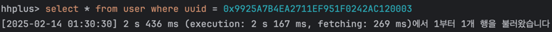
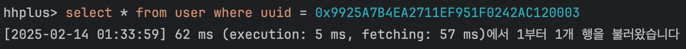
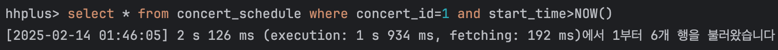
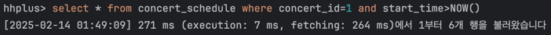
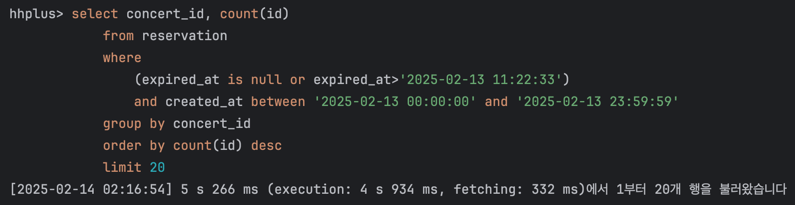
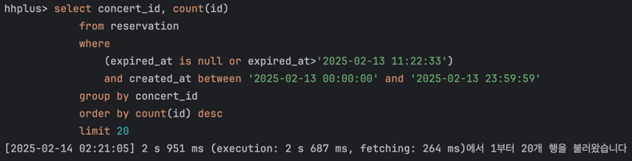
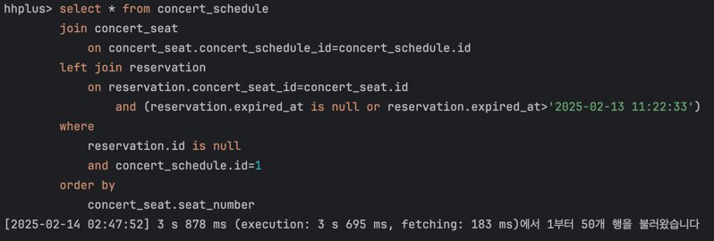
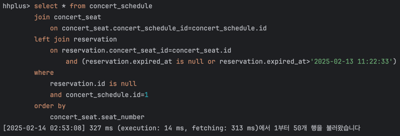

# 데이터베이스 인덱스 기반 성능 개선 보고서

## 개요

본 보고서는 콘서트 예약 시나리오에서 자주 사용되는 쿼리들을 대상으로 인덱스 추가 전후의 성능 개선 효과를 분석한 결과를 정리한 문서입니다.  
분석 대상 쿼리는 다음과 같습니다.

- **UUID 기반 사용자 조회**: `user` 테이블에서 UUID를 기준으로 단일 row를 조회하는 쿼리
- **콘서트 날짜 조회**: `concert_schedule` 테이블에서 예약 가능한 콘서트 일정을 조회하는 쿼리
- **인기 콘서트 목록 조회**: `reservation` 테이블에서 예약 데이터를 기반으로 인기 콘서트를 집계하는 쿼리
- **콘서트 좌석 조회**: 여러 테이블(`concert_schedule`, `concert_seat`, `reservation`)의 조인을 통해 좌석 조회 및 예약 여부를 확인하는 복잡한 쿼리

각 쿼리에 대해 인덱스 추가 전후의 **Explain** 결과와 실제 실행시간을 비교하여, 인덱스 적용의 필요성과 효과를 상세히 분석하였습니다.

---

## 1. UUID 기반 사용자 조회

### 쿼리 내용
```sql
select * from user where uuid=?
```
- **테스트 데이터 개수**: 1,000만 건

### 인덱스 적용 전

인덱스 미적용 시 전체 테이블 스캔이 발생하여, 아래와 같은 Explain 결과와 함께 약 **2s 436ms**의 실행시간이 소요되었습니다.

| id | select_type | table | partitions | type | possible_keys | key | key_len | ref  | rows   | filtered | Extra       |
|:---|:-----------|:------|:-----------|:-----|:--------------|:----|:--------|:-----|:-------|:---------|:------------|
| 1  | SIMPLE     | user  | null       | ALL  | null          | null| null    | null | 9742405| 10       | Using where |



### 인덱스 적용 후

**인덱스 추가 쿼리:**
```sql
CREATE UNIQUE INDEX uk_user_uuid ON user(uuid);
```

인덱스 적용 후, uuid 컬럼에 대해 유니크 인덱스가 생성되어 "const" 방식으로 인덱스 스캔이 가능해졌으며, 실제 조회되는 row 수가 1건으로 줄어들어 성능이 크게 개선되었습니다.

| id | select_type | table | partitions | type  | possible_keys | key       | key_len | ref   | rows | filtered | Extra |
|:---|:-----------|:------|:-----------|:------|:--------------|:----------|:--------|:------|:-----|:---------|:------|
| 1  | SIMPLE     | user  | null       | const | user_uuid     | user_uuid | 16      | const | 1    | 100      | null  |



> **개선 효과**: 인덱스 적용 전 2,436ms에서 62ms로 약 97% 이상의 실행시간 단축

---

## 2. 콘서트 날짜 조회

### 쿼리 내용
```sql
select * from concert_schedule where concert_id=? and start_time>?
```
- **테스트 데이터 개수**: 1,000만 건

### 인덱스 적용 전

인덱스 미적용 시 전체 테이블 스캔이 발생하며, 아래와 같은 Explain 결과와 함께 약 **2s 126ms**의 실행시간이 소요되었습니다.

| id | select_type | table            | partitions | type | possible_keys | key  | key_len | ref  | rows   | filtered | Extra       |
|:---|:-----------|:-----------------|:-----------|:-----|:--------------|:-----|:--------|:-----|:-------|:---------|:------------|
| 1  | SIMPLE     | concert_schedule | null       | ALL  | null          | null | null    | null | 9717420| 3.33     | Using where |



### 인덱스 적용 후

**인덱스 추가 쿼리:**
```sql
CREATE INDEX idx_concert_schedule_concert_id_start_time ON concert_schedule(concert_id, start_time);
```

- **인덱스 작성 이유**: `concert_id`와 `start_time`의 복합 인덱스를 생성하여 조건에 따른 범위 검색을 효율화
- **Explain 결과**: "range" 타입으로 스캔되는 row 수가 6건으로 대폭 감소

| id | select_type | table            | partitions | type  | possible_keys                                             | key                                               | key_len | ref  | rows | filtered | Extra                   |
|:---|:-----------|:-----------------|:-----------|:------|:----------------------------------------------------------|:--------------------------------------------------|:--------|:-----|:-----|:---------|:------------------------|
| 1  | SIMPLE     | concert_schedule | null       | range | idx_concert_schedule_concert_id_start_time                | idx_concert_schedule_concert_id_start_time        | 13      | null | 6    | 100      | Using index condition   |



> **개선 효과**: 인덱스 적용 전 2,126ms에서 271ms로 약 87%의 실행시간 개선

---

## 3. 인기 콘서트 목록 조회

### 쿼리 내용
```sql
select concert_id, count(id)
from reservation
where
(expired_at is null or expired_at>?)
and created_at between ? and ?
group by concert_id
order by count(id) desc
limit 20
```
- **테스트 데이터 개수**: 1,000만 건

### 인덱스 적용 전

인덱스 미적용 시, 전체 테이블 스캔과 임시 테이블, 파일 정렬 사용으로 인해 아래와 같은 Explain 결과와 함께 약 **5s 266ms**의 실행시간이 소요되었습니다.

| id | select_type | table       | partitions | type | possible_keys | key  | key_len | ref  | rows    | filtered | Extra                                             |
|:---|:-----------|:------------|:-----------|:-----|:--------------|:-----|:--------|:-----|:--------|:---------|:--------------------------------------------------|
| 1  | SIMPLE     | reservation | null       | ALL  | null          | null | null    | null | 9948970 | 4.44     | Using where; Using temporary; Using filesort     |



### 인덱스 적용 후

**인덱스 추가 쿼리:**
```sql
CREATE INDEX idx_reservation_created_at_expired_at_concert_id ON reservation(created_at, expired_at, concert_id);
```

- **인덱스 작성 이유**:
  - 시간 관련 컬럼(`created_at`, `expired_at`)의 경우 카디널리티가 높을 수밖에 없어, 쿼리 기준으로 가장 조회 범위를 줄일 수 있는 컬럼인 `created_at`을 첫 번째 컬럼으로 배치
  - `concert_id`를 포함한 커버링 인덱스 형태로 구성하여 조회 효율을 향상
- **Explain 결과**: "range" 스캔이 사용되나 임시 테이블 및 파일 정렬은 여전히 발생함

| id | select_type | table       | partitions | type  | possible_keys                                              | key                                               | key_len | ref  | rows    | filtered | Extra                                                  |
|:---|:-----------|:------------|:-----------|:------|:-----------------------------------------------------------|:--------------------------------------------------|:--------|:-----|:--------|:---------|:-------------------------------------------------------|
| 1  | SIMPLE     | reservation | null       | range | idx_reservation_created_at_expired_at_concert_id           | idx_reservation_created_at_expired_at_concert_id    | 11      | null | 4974485 | 40       | Using where; Using index; Using temporary; Using filesort |



> **개선 효과**: 인덱스 적용 전 5,266ms에서 2,951ms로 약 44%의 실행시간 개선

---

## 4. 콘서트 좌석 조회

### 쿼리 내용
```sql
select * from concert_schedule
join concert_seat
on concert_seat.concert_schedule_id = concert_schedule.id
left join reservation
on reservation.concert_seat_id = concert_seat.id
and (reservation.expired_at is null or reservation.expired_at > ?)
where
reservation.id is null
and concert_schedule.id = ?
order by
concert_seat.seat_number
```
- **테스트 데이터 개수**:
  - `concert_schedule`: 10만 건
  - `concert_seat`: 500만 건 (콘서트 스케줄 당 50개 좌석)
  - `reservation`: 1,000만 건

### 인덱스 적용 전

인덱스 미적용 시, 각 테이블에서 전체 스캔이 발생하며 특히 `concert_seat`와 `reservation` 테이블에서 대량의 row를 스캔하여 해시 조인 등의 추가 작업이 필요하게 되어 약 **3s 878ms**의 실행시간이 소요되었습니다.

| id | select_type | table            | partitions | type | possible_keys | key   | key_len | ref  | rows    | filtered | Extra                                                        |
|:---|:-----------|:-----------------|:-----------|:-----|:--------------|:------|:--------|:-----|:--------|:---------|:-------------------------------------------------------------|
| 1  | SIMPLE     | concert_schedule | null       | const| PRIMARY       | PRIMARY| 8       | const| 1       | 100      | Using temporary; Using filesort                             |
| 1  | SIMPLE     | concert_seat     | null       | ALL  | null          | null   | null    | null | 4853772 | 10       | Using where                                                 |
| 1  | SIMPLE     | reservation      | null       | ALL  | null          | null   | null    | null | 9951600 | 10       | Using where; Not exists; Using join buffer (hash join)        |



### 인덱스 적용 후

**인덱스 추가 쿼리:**
```sql
CREATE INDEX idx_concert_seat_concert_schedule_id ON concert_seat(concert_schedule_id);
CREATE INDEX idx_reservation_concert_seat_id ON reservation(concert_seat_id);
```

- **인덱스 작성 이유**:
  - `concert_seat` 테이블에서는 `concert_schedule_id`를 기준으로 필요한 좌석만 빠르게 조회
  - `reservation` 테이블에서는 `concert_seat_id`를 기준으로 예약 여부를 신속하게 확인
- **Explain 결과**:
  - `concert_schedule`은 PRIMARY 키로 1건 조회
  - `concert_seat`는 ref 방식으로 50건 조회
  - `reservation`은 ref 방식으로 1건 조회하여 효율적인 조인이 이루어짐

| id | select_type | table            | partitions | type | possible_keys                              | key                                      | key_len | ref                      | rows | filtered | Extra                             |
|:---|:-----------|:-----------------|:-----------|:-----|:-------------------------------------------|:-----------------------------------------|:--------|:-------------------------|:-----|:---------|:----------------------------------|
| 1  | SIMPLE     | concert_schedule | null       | const| PRIMARY                                    | PRIMARY                                  | 8       | const                    | 1    | 100      | Using filesort                  |
| 1  | SIMPLE     | concert_seat     | null       | ref  | idx_concert_seat_concert_schedule_id       | idx_concert_seat_concert_schedule_id     | 8       | const                    | 50   | 100      | null                            |
| 1  | SIMPLE     | reservation      | null       | ref  | idx_reservation_concert_seat_id            | idx_reservation_concert_seat_id          | 8       | hhplus.concert_seat.id   | 1    | 10       | Using where; Not exists         |



> **개선 효과**: 인덱스 적용 전 3,878ms에서 327ms로 약 91% 이상의 실행시간 단축

---

## 결론

본 보고서에서는 자주 조회되거나 복잡한 조건을 포함하는 주요 쿼리들을 대상으로 인덱스 추가 전후의 **Explain** 결과와 실행시간을 비교 분석하였습니다.
- **UUID 기반 사용자 조회**: 유니크 인덱스 적용을 통해 단일 row 조회 시 97% 이상의 성능 개선 달성
- **콘서트 날짜 조회**: 복합 인덱스를 활용하여 범위 검색 효율성을 극대화, 약 87%의 실행시간 개선
- **인기 콘서트 목록 조회**: 조건 컬럼 순서에 따른 인덱스 구성으로 임시 테이블과 파일 정렬 사용을 줄여 약 44% 개선
- **콘서트 좌석 조회**: 조인에 사용되는 컬럼에 인덱스 추가로 전체 스캔 범위 축소, 91% 이상의 성능 향상

이와 같이, 쿼리 특성에 맞는 적절한 인덱스 설계는 데이터베이스 성능 최적화에 매우 중요한 역할을 하며, 실행 계획(Explain)을 지속적으로 모니터링하고 개선할 필요가 있음을 확인할 수 있습니다.