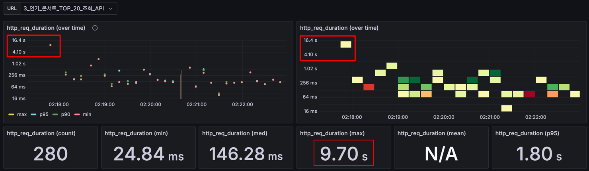
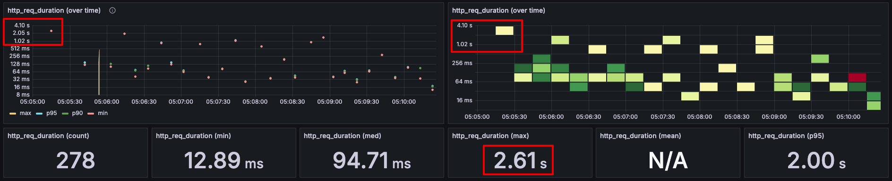

# 인기 콘서트 TOP 20 조회 API 장애 대응 보고서

## 1. 장애 요약

인기 콘서트 TOP 20 조회 API(이하 “인기 콘서트 API”)의 **초기 접근** 시점에서 캐시가 비어 있어, 첫 요청에 대한 응답 시간이 최대 9.70초까지 소요되었습니다.  
이로 인해 사용자들께서 페이지 응답 지연 또는 타임아웃 등을 겪으셨으며, 서비스 초기 진입에 차질이 발생하였습니다.

## 2. 장애 영향도

- **예약 차질 발생**: 콘서트 정보를 빠르게 확인하고자 했던 초기에 접속하신 분들께서 **오랜 대기**를 겪어 예약에 실패하는 경우가 있었습니다.
- **시스템 리소스**: 캐시가 없는 상황에서 DB 쿼리 및 내부 집계 로직이 동시 다발적으로 실행되어, 서버 CPU 및 DB 리소스를 일시적으로 더 많이 점유하였습니다.

## 3. 장애 원인

- 인기 콘서트 API는 **집계 로직**을 수행하고, 조회 결과를 캐시에 저장하도록 설계되어 있습니다.
- **초기 요청** 시점(서버 재시작 직후 또는 캐시 만료 직후)에는 캐시가 비어, **DB 접근 후 집계 연산**을 수행하느라 응답 시간이 길어졌습니다.
- 이후 요청은 캐시에 의해 빠르게 응답되지만, **초기 요청**을 처리하는 동안은 사용자 지연이 필연적으로 발생하였습니다.

## 4. 장애 처리 타임라인별 행동

1. **장애 인지 (T0)**
    - 일부 사용자께서 응답 지연으로 인한 불편을 고객센터를 통해 접수하셨습니다.
    - 모니터링 대시보드에서 인기 콘서트 API의 응답 시간이 9초 이상 걸리는 건이 관측되었습니다.
      

2. **원인 파악 (T0~T+10분)**
    - 해당 API가 캐시가 비어 있을 때만 매우 느려진다는 점을 모니터링을 통해 확인하였습니다.
    - 내부적으로 집계 쿼리 수행 → 결과를 메모리 캐시에 저장하고, 이후에는 빠르게 응답한다는 로직이었음을 재확인했습니다.

3. **응급 조치 (T+10분~T+20분)**
    - 우선 서버에 **캐시 Pre-warming** 로직을 적용하였습니다.
    - 서버 시작 시 및 일정 주기(캐시 만료 직전)에 인기 콘서트 API를 **백그라운드에서 미리 호출**하여 캐시를 채워두도록 수정하였습니다.

4. **장애 해소 (T+20분 이후)**
    - Pre-warming 적용 후, **첫 사용자**가 실제 요청하기 전 이미 캐시에 데이터가 준비되므로, 응답 시간이 큰 폭으로 단축되었습니다.
    - 추가로, 운영 모니터링을 통해 재발 여부를 모니터링하였으며, 초기 응답 속도가 큰 폭으로 개선되었습니다. 또한 더 이상 초기 접근 지연 보고가 없었습니다.

## 5. 장애 재발 대비책

- **캐시 만료 시점 조정**
    - 인기 콘서트 API는 빈번히 조회되어야 하므로, 캐시 만료 시간을 초과하지 않도록 만료 시간 대비 30초 빠른 시간에 다시 Pre-warming하는 방식으로 재발 가능성을 낮추었습니다.
- **알림 자동화**
    - API의 응답 시간이 길어지면 자동으로 알림이 발송되도록 설정하여 빠른 대응이 가능하도록 하였습니다.

## 6. 그 외 추가 정보

- 본 장애는 **캐시가 비어 있을 때 발생하는 스파이크 지연**이 주원인이었으며, Pre-warming 이외에도 DB 리소스 확충, 집계 로직 분리, 이벤트 기반 캐시 갱신 등 다양한 방안을 고려할 수 있습니다.
- 향후 대규모 트래픽이 예상될 경우, **부하 테스트**를 통해 캐시 미스 상황에서의 응답 지연을 사전에 점검하는 절차를 마련할 계획입니다.
