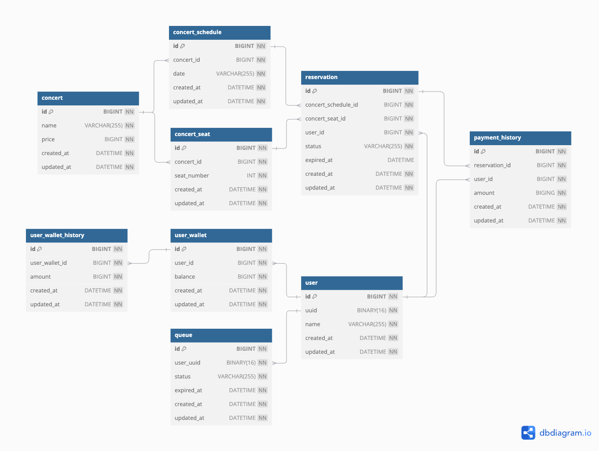

# ERD



## DBML

```
Table concert as "콘서트" {
  id BIGINT [pk, not null] // 콘서트 ID
  name VARCHAR(255) [not null] // 콘서트 이름
  price BIGINT [not null] // 콘서트 가격
  created_at DATETIME [not null] // 생성 시각
  updated_at DATETIME [not null] // 수정 시각
}

Table concert_schedule as "콘서트 일정" {
  id BIGINT [pk, not null] // 콘서트 일정 ID
  concert_id BIGINT [not null, ref: > concert.id] // 콘서트 ID
  date VARCHAR(255) [not null] // 콘서트 날짜
  created_at DATETIME [not null] // 생성 시각
  updated_at DATETIME [not null] // 수정 시각

  indexes {
    (concert_id, date) [unique] // UNIQUE 제약 조건
  }
}

Table concert_seat as "콘서트 좌석" {
  id BIGINT [pk, not null] // 콘서트 좌석 ID
  concert_id BIGINT [not null, ref: > concert.id] // 콘서트 ID
  seat_number INT [not null] // 콘서트 좌석 번호
  created_at DATETIME [not null] // 생성 시각
  updated_at DATETIME [not null] // 수정 시각

  indexes {
    (concert_id, seat_number) [unique] // UNIQUE 제약 조건
  }
}

Table reservation as "예약" {
  id BIGINT [pk, not null] // 콘서트 예약 ID
  concert_schedule_id BIGINT [not null, ref: > concert_schedule.id] // 콘서트 일정 ID
  concert_seat_id BIGINT [not null, ref: > concert_seat.id] // 콘서트 좌석 ID
  user_id BIGINT [not null, ref: > user.id] // 유저 ID
  status VARCHAR(255) [not null] // 예약 상태
  expired_at DATETIME [null] // 임시 배정 만료 시각
  created_at DATETIME [not null] // 생성 시각
  updated_at DATETIME [not null] // 수정 시각
}

Table user as "유저" {
  id BIGINT [pk, not null] // 유저 ID
  uuid BINARY(16) [not null] // 유저 UUID
  name VARCHAR(255) [not null] // 유저 이름
  created_at DATETIME [not null] // 생성 시각
  updated_at DATETIME [not null] // 수정 시각

  indexes {
    (uuid) [unique] // UNIQUE 제약 조건
  }
}

Table user_wallet as "유저 지갑" {
  id BIGINT [pk, not null] // 유저 지갑 ID
  user_id BIGINT [not null, ref: > user.id] // 유저 ID
  balance BIGINT [not null] // 유저 잔액
  created_at DATETIME [not null] // 생성 시각
  updated_at DATETIME [not null] // 수정 시각

  indexes {
    (user_id) [unique] // UNIQUE 제약 조건
  }
}

Table user_wallet_history as "유저 지갑 이력" {
  id BIGINT [pk, not null] // 유저 지갑 이력 ID
  user_wallet_id BIGINT [not null, ref: > user_wallet.id] // 유저 지갑 ID
  amount BIGINT [not null] // 증감액
  created_at DATETIME [not null] // 생성 시각
  updated_at DATETIME [not null] // 수정 시각

  indexes {
    (user_wallet_id) [unique] // UNIQUE 제약 조건
  }
}

Table queue as "대기열" {
  id BIGINT [pk, not null] // 대기열 ID
  user_uuid BINARY(16) [not null, ref: > user.uuid] // 유저 UUID
  status VARCHAR(255) [not null] // 대기 상태
  expired_at DATETIME [not null] // 만료 시각
  created_at DATETIME [not null] // 생성 시각
  updated_at DATETIME [not null] // 수정 시각

  indexes {
    (user_uuid) [unique] // UNIQUE 제약 조건
  }
}

Table payment_history as "결제 이력" {
  id BIGINT [pk, not null] // 결제 이력 ID
  reservation_id BIGINT [not null, ref: > reservation.id] // 예약 ID
  user_id BIGINT [not null, ref: > user.id] // 유저 ID
  amount BIGING [not null] // 결제 금액
  created_at DATETIME [not null] // 생성 시각
  updated_at DATETIME [not null] // 수정 시각
}
```