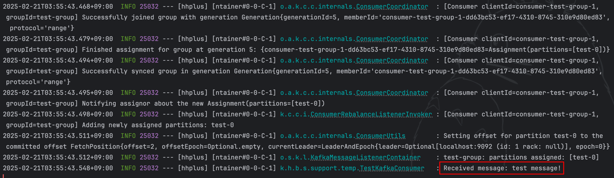
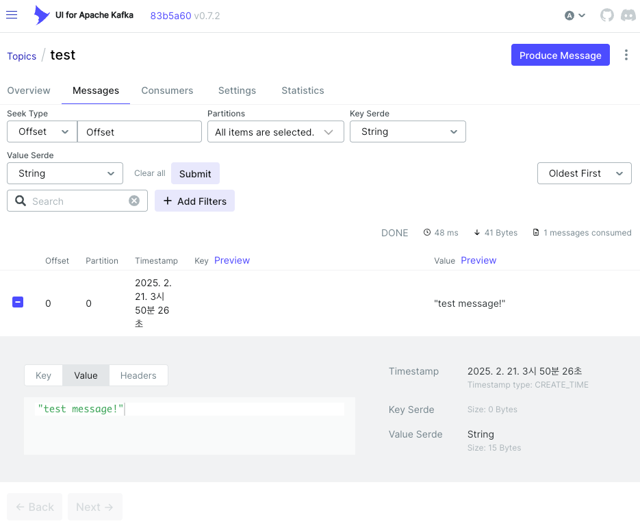

## Kafka 연동 확인

해당 문서에서는 시스템에 카프카를 성공적으로 연동한 결과를 기록합니다.

### 확인 절차

1. `docker-compose up -d`로 전체 인프라 실행
2. Application 실행
    - 실행 시 `TestKafkaProducer` 내부에서 최초 1회 메시지 즉시 발행
3. `TestKafkaConsumer`를 통해 콘솔에서 카프카 메시지 즉시 확인
   
4. Kafka UI 접속하여 확인 (http://localhost:8081)
   