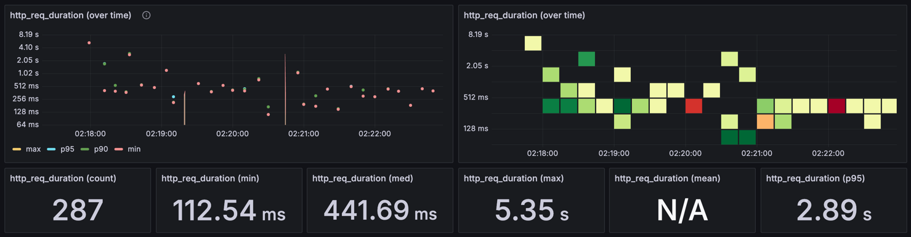

# 성능 테스트 보고서

## 1. 개요

본 문서는 로컬 환경에서 실행된 k6 기반 성능 테스트 결과를 정리한 보고서입니다.  
해당 시나리오는 서비스 초기에 사용자(유저)가 콘서트 결제를 완료하기까지 진행되는 **전체 플로우**(대기열 토큰 발급 → 대기 순위 조회 → 콘서트 정보 조회 → 좌석 예약 → 잔액 충전 → 결제) 과정을 실제 API 호출과 유사하게 구성하였습니다.

## 2. API 목록

아래 표는 본 시나리오에서 사용된 주요 API와 Endpoint입니다.

| 번호 | API 명                | Endpoint                                                   |
|:--:|:---------------------|:-----------------------------------------------------------|
| 1  | 대기열 토큰 발급 API        | `POST /api/v1/queues/token`                                |
| 2  | 대기열 토큰 대기 순위 조회 API  | `GET /api/v1/queues/token/rank`                            |
| 3  | 인기 콘서트 TOP 20 조회 API | `GET /api/v1/reservations/concert/popular`                 |
| 4  | 콘서트 목록 조회 API        | `GET /api/v1/concerts?page=1&size=20`                      |
| 5  | 콘서트 일정 조회 API        | `GET /api/v1/concerts/{concertId}/schedules`               |
| 6  | 콘서트 좌석 조회 API        | `GET /api/v1/concerts/schedules/{concertScheduleId}/seats` |
| 7  | 콘서트 예약(좌석 선점) API    | `POST /api/v1/reservations/concert`                        |
| 8  | 잔액 조회 API            | `GET /api/v1/user-wallets/balance`                         |
| 9  | 잔액 충전 API            | `PATCH /api/v1/user-wallets/balance`                       |
| 10 | 콘서트 결제 API           | `POST /api/v1/reservations/concert/payment`                |

## 3. 테스트 데이터의 양

로컬 DB에는 아래와 같은 초기 데이터를 세팅하였습니다.

- **유저(user)**: 100만 건
- **유저 지갑(user_wallet)**: 100만 건 (user와 1:1 매핑)
- **콘서트(concert)**: 1만 건
- **콘서트 일정(concert_schedule)**: 10만 건 (콘서트당 10건씩)
- **콘서트 좌석(concert_seat)**: 500만 건 (콘서트 일정당 50건씩)

## 4. 시나리오 관련 내용

- k6 부하 테스트 시나리오 : [e2e.js](../k6/e2e.js) 파일 참고
- **DB maximum-pool-size**: 50
- **VU(동시 사용자) 수**: 10
- **Iteration 수(각 VU 당 반복 횟수)**: 30
- **시나리오 흐름**:
    1) 대기열 토큰 발급
    2) 대기 순위 조회(상태가 `ACTIVE`가 될 때까지 1초마다 폴링)
    3) 인기 콘서트 조회 및 콘서트 목록 조회
    4) 콘서트 일정 조회 → 콘서트 좌석 조회
    5) 좌석 선점(예약)
    6) 잔액 조회 → 잔액 충전
    7) 콘서트 결제
- **테스트 목표**:
    - 로컬 환경에서 End-to-End 시나리오를 수행하여 **상대적으로 처리 시간이 긴 API**를 식별합니다.
    - 실제 운영 환경과는 다를 수 있으나, **병목 가능성**이 있는 지점을 사전에 파악할 수 있습니다.

## 5. 테스트 절차

세부 절차는 [성능 테스트 절차](./load-test-step.md) 파일을 참고하시기 바랍니다.

1. **사전 세팅**: 로컬 DB에 위 테스트 데이터를 적재하고, 서버를 구동합니다.
2. **k6 스크립트 실행**: 위 시나리오(10명의 VU, 각 30회 반복)를 통해 각 API 당 300회 가량의 요청을 발생시킵니다. (대기 순위 조회 API는 폴링에 의해 더 많은 호출 발생)
3. **로그 및 모니터링 확인**: k6 콘솔 출력 및 내부 DB, 애플리케이션 로그를 확인하여 에러 유무를 파악합니다.
4. **결과 수집**: 각 API의 응답 시간 분포를 기록하고, **평균/중간값/최댓값/p95** 등의 통계치를 추출합니다.

## 6. 테스트 결과

아래 표는 API별 `http_req_duration` 지표를 요약한 것입니다. 표의 각 열은 다음을 의미합니다:

- **Count**: 호출 횟수
- **Min**: 최소 응답 시간
- **Med**: 중간값(50th percentile)
- **Max**: 최대 응답 시간
- **p95**: 95th percentile(95% 요청이 이 시간 이하로 응답)

| API                     | Count |   Min    |     Med      |    Max    |    p95    |
|:------------------------|:-----:|:--------:|:------------:|:---------:|:---------:|
| 1) 대기열 토큰 발급 API        |  295  | 10.53ms  |   44.48ms    |   2.61s   |   1.79s   |
| 2) 대기열 토큰 대기 순위 조회 API  | 1854  |  4.02ms  |   65.93ms    |   2.04s   |   1.35s   |
| 3) 인기 콘서트 TOP 20 조회 API |  280  | 24.84ms  |   146.28ms   | **9.70s** |   1.80s   |
| 4) 콘서트 목록 조회 API        |  292  | 49.68ms  |   147.24ms   |   3.53s   | 931.51ms  |
| 5) 콘서트 일정 조회 API        |  292  | 16.78ms  |   63.49ms    |   1.27s   |   1.22s   |
| 6) 콘서트 좌석 조회 API        |  287  | 21.97ms  |   147.01ms   |   2.89s   |   1.84s   |
| 7) 콘서트 예약 API (좌석 선점)   |  287  | 112.54ms | **441.69ms** | **5.35s** | **2.89s** |
| 8) 잔액 조회 API            |  288  | 14.33ms  |   43.51ms    | 738.25ms  | 289.25ms  |
| 9) 잔액 충전 API            |  287  | 34.82ms  |   153.10ms   |   3.33s   |   1.97s   |
| 10) 콘서트 결제 API          |  280  | 102.33ms |   277.17ms   |   2.55s   |   2.54s   |

## 7. 결론

- **상대적으로 응답 시간이 긴 API**
    - **3) 인기 콘서트 조회 API**와 **7) 콘서트 예약 API**의 응답 시간이 다른 API들에 비해 오래 소요되는 것을 확인할 수 있습니다.

### 3) 인기 콘서트 TOP 20 조회 API

- **3) 인기 콘서트 TOP 20 조회 API**의 경우 최초 1회의 요청이 가장 오랜 시간 소요되는 것을 확인할 수 있습니다.
    - 해당 API는 다른 API들과 달리 집계가 필요하여 어느 정도 시간 소요가 불가피한 API로써, 캐시를 적용하여 응답 속도를 개선한 이력이 있습니다.
    - 따라서 최초 1회 요청 이후 캐시가 적용되어 이후 요청의 응답 시간은 빠르게 처리되는 것을 확인할 수 있습니다.
    - 최초 1회 요청의 성능을 개선하기 위해, 배치/스크립트로 정기적으로 캐시 갱신하는 등 **캐시 Pre-warming 방식을 고려**할 수 있습니다.

### 7) 콘서트 예약 API

- **7) 콘서트 예약 API**의 경우 다른 API들에 비해 중간값, p95의 수치가 가장 높게 나타나는 것을 확인할 수 있습니다.
    - 해당 API는 내부 로직에서 예약 좌석 선점 및 결제 처리를 수행하며, MSA 환경에서 API 연동까지 가정하고 있습니다.
    - 예약 좌석 선점 시 동시성 제어 및 여러 번의 DB 요청으로 인해 어느 정도 불가피한 지연이 발생할 수 있습니다.
    - 해당 API 특성상 **좌석 선점 실패 시의 응답 속도가 중요**하며, 성공 시에는 좌석 선점 처리가 되어 사용자가 여유있게 이후 프로세스를 진행해도 무방하기 때문에 성능 개선을 크게 고려하지 않아도 될
      것으로 판단합니다.
