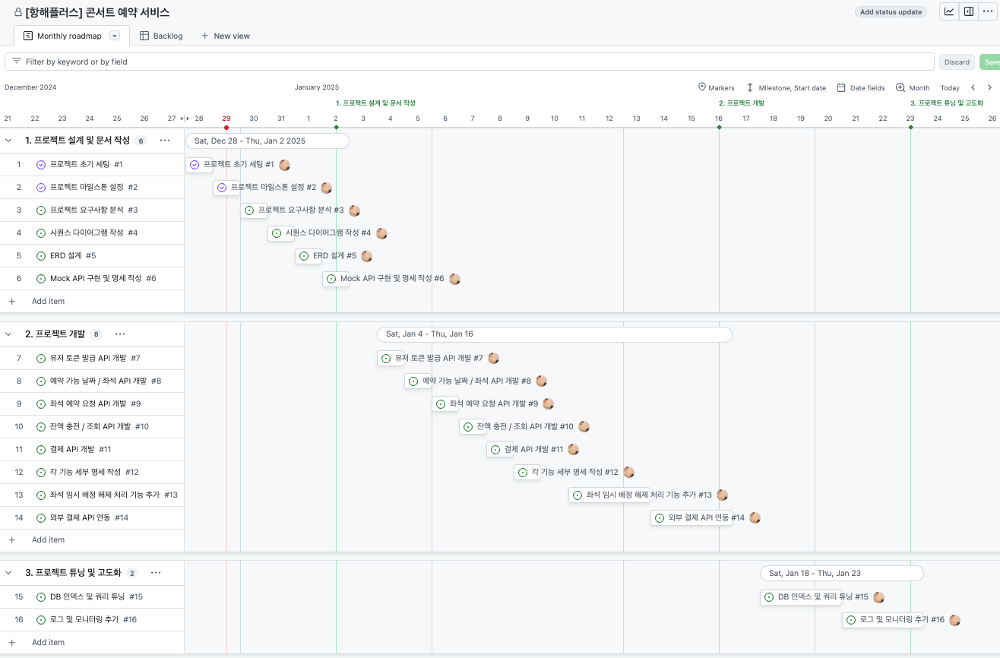

# 프로젝트 Milestone

- GitHub Projects로 Issue 단위로 프로젝트 Milestone을 관리합니다.
- 프로젝트 설계 및 문서 작성 이후로는 확정된 바 없어 프로젝트 기간 및 요구사항 기반 하에 임의로 작성되었습니다.
    1. 프로젝트 설계 및 문서 작성 (1주)
    2. 프로젝트 개발 (2주)
    3. 프로젝트 튜닝 및 고도화 (1주)

## Milestone 및 Issue 관리

- GitHub Projects의 Monthly roadmap 탭에서 아래와 같이 프로젝트 로드맵을 확인할 수 있습니다.
    - [Monthly Roadmap](https://github.com/users/psh10066/projects/2/views/1)

- GitHub Issues의 Milestones 페이지에서 Milestone 단위의 작업 현황을 확인하고 관리할 수 있습니다.
    - [GitHub Milestones](https://github.com/psh10066/hhplus-server-concert/milestones?direction=asc&sort=due_date)

- GitHub Projects의 Backlog 탭에서 아래와 같이 작업 단위로 관리할 수 있습니다.
    - [Backlog](https://github.com/users/psh10066/projects/2/views/3)

