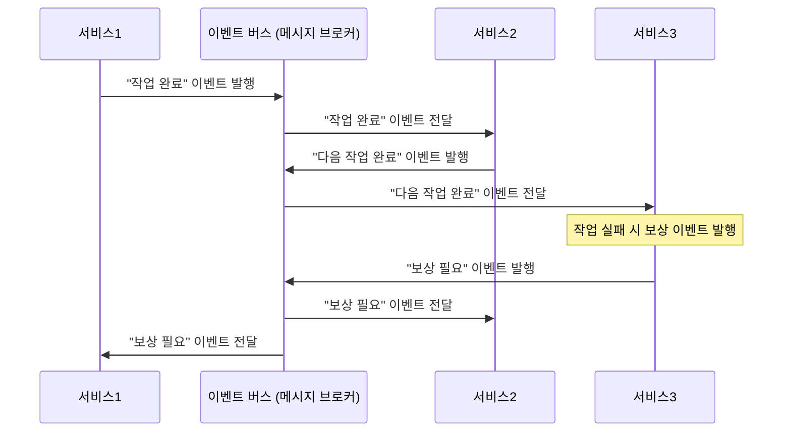
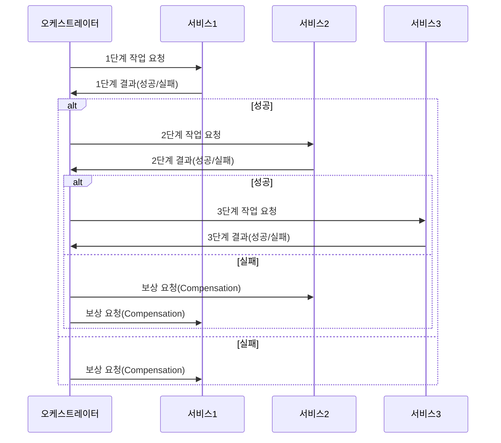

# MSA 전환에 따른 트랜잭션 처리 방안

## 1. 배경
오늘날 다양한 서비스를 운영하면서 트래픽이 증가하고, 기능 요구사항이 복잡해지는 상황에 대응하기 위해 **마이크로서비스 아키텍처(MSA)** 로의 전환을 고려하는 사례가 많습니다.  
모놀리식 구조에서는 모든 기능이 하나의 배포 단위로 묶여 있으나, 서비스 규모가 확장됨에 따라 아래와 같은 문제들이 발생할 수 있습니다.

- 배포나 스케일링이 유연하지 않음
- 특정 모듈 장애로 전체 서비스에 영향이 발생
- 유지보수가 어려워지고, 개발 속도가 저하

이에 따라 **각 도메인별로 서비스와 DB를 독립**시켜 나누는 MSA가 주목받고 있습니다.

## 2. 문제제기
모놀리식 환경에서는 단일 DB와 트랜잭션 매니저를 통해 **ACID** 트랜잭션을 쉽게 보장할 수 있었습니다. 그러나 MSA로 분리하면, 각 서비스마다 별도의 DB를 사용하기 때문에 단일 트랜잭션으로 처리하던 로직이 **분산 트랜잭션**이 되어버립니다.  
이로 인해 다음과 같은 어려움이 나타납니다.

- 여러 서비스(서로 다른 DB) 간 트랜잭션 동기화가 복잡해짐
- 네트워크/시스템 장애 발생 시, 일관성(Consistency)을 보장하기 어려움
- 트랜잭션 범위가 넓어져 성능 저하 및 장애 전파 가능성 상승

## 3. AS-IS: 모놀리식 트랜잭션 처리
모놀리식 구조에서는 다음과 같은 특징을 갖습니다.

1. **단일 배포 단위**  
   모든 기능이 하나의 코드베이스로 구성되어 있어, 빌드 및 배포도 한 번에 진행됩니다.

2. **단일 DB**  
   하나의 DB를 사용함으로써, 로컬 트랜잭션으로 **ACID**를 쉽게 보장할 수 있습니다.

3. **트랜잭션 범위**  
   여러 기능(예약, 결제, 재고 등)이 하나의 DB로 동작하므로, DB 레벨에서 트랜잭션 일관성을 확보합니다.

- **장점**: 구현이 단순하며, 트랜잭션 관리가 직관적입니다.
- **단점**: 서비스 로직이 비대해지고, 전체 서비스를 함께 배포해야 하므로 확장이 어렵습니다.

## 4. TO-BE 선택지
MSA로 전환하고 각 도메인을 독립 서비스로 분리하려 할 때, **분산 트랜잭션**을 다루는 대표적인 두 가지 방법이 있습니다.

### 2PC (Two-Phase Commit)
  - 분산 환경에서 여러 노드(서비스) 간 원자적 커밋/롤백을 보장하기 위해 **코디네이터**가 Prepare, Commit(또는 Rollback) 과정을 진행합니다.
  - 모든 참여 노드가 커밋 가능한 상태를 “승인”하면 최종 커밋, 하나라도 불가능하면 롤백합니다.

  ```mermaid
  sequenceDiagram
    participant C as 코디네이터
    participant S1 as 서비스1
    participant S2 as 서비스2
  
    C->>S1: 준비 요청(Prepare)
    S1->>C: 준비 OK / 준비 불가
    C->>S2: 준비 요청(Prepare)
    S2->>C: 준비 OK / 준비 불가
  
    alt 모든 서비스 준비 OK
      C->>S1: 커밋 요청(Commit)
      C->>S2: 커밋 요청(Commit)
    else 준비 실패 서비스 존재
      C->>S1: 롤백 요청(Rollback)
      C->>S2: 롤백 요청(Rollback)
    end
  ```

### SAGA 패턴
  - 여러 로컬 트랜잭션을 순차적으로 연결하고, 중간에 실패가 발생하면 이전 단계들을 **보상 트랜잭션**(Compensation)으로 되돌리는 방식입니다.
  - **최종적 일관성(Eventual Consistency)** 을 목표로 하며, 구현 방법에 따라 아래 두 형태로 나뉩니다.

#### (1) 코레오그래피(Choreography) 기반 SAGA
  - 중앙 오케스트레이션 없이, 각 서비스가 이벤트를 발행하고 다른 서비스가 해당 이벤트를 구독하여 다음 로컬 트랜잭션을 수행합니다.
  - 중간에 어떤 서비스에서 실패가 발생하면, 그에 대응하는 보상(rollback) 이벤트를 발행하여 이미 완료된 트랜잭션들을 되돌립니다.
  - **장점**: 단일 장애 지점이 없고, 서비스 간 느슨한 결합이 용이합니다.
  - **단점**: 이벤트 플로우가 복잡해질수록 시스템 전반 모니터링과 롤백 시나리오 관리가 까다로워집니다.



#### (2) 오케스트레이션(Orchestration) 기반 SAGA
  - ‘오케스트레이터’라는 중앙 역할이 전체 트랜잭션 흐름을 관리하고, 각 서비스에게 작업을 지시(Command)합니다.
  - 실패 시점이 발생하면 오케스트레이터가 보상 트랜잭션(Compensation)을 호출하여 롤백합니다.
  - **장점**: 중앙 관리로 트랜잭션 전 과정 모니터링이 용이하고, 트랜잭션 흐름을 한눈에 파악하기 쉽습니다.
  - **단점**: 오케스트레이터 장애 시 전체 트랜잭션 수행에 영향이 있으며, 중앙 노드에 부하가 집중될 수 있습니다.



## 5. 개념 간략 설명
- **ACID**  
  데이터베이스 트랜잭션에서 원자성(Atomicity), 일관성(Consistency), 고립성(Isolation), 지속성(Durability)을 의미하는 표준적인 특성입니다.

- **분산 트랜잭션(Distributed Transaction)**  
  여러 노드나 서비스(DB 포함)에 걸쳐 수행되는 트랜잭션으로, 각 로컬 트랜잭션의 상태를 동기화해야 하는 어려움이 존재합니다.

- **2PC**  
  ```
  1) Prepare: 모든 노드에게 “커밋 준비 OK?” 물어봄
  2) Commit/Rollback: 전원이 OK면 커밋, 하나라도 NO면 즉시 롤백
  ```

- **SAGA**  
  ```
  1) 로컬 트랜잭션들을 순서대로 실행
  2) 중간 실패 발생 시, 이전 단계들을 되돌리기 위한 보상(Compensation) 트랜잭션 실행
  ```

## 6. AS-IS vs TO-BE 비교 분석
1. **데이터 일관성**
  - AS-IS(모놀리식): 단일 DB에서 모든 처리가 일어나므로, ACID 트랜잭션이 비교적 쉽게 보장됩니다.
  - TO-BE(MSA): 각 서비스마다 DB가 분리되므로, 트랜잭션이 분산됨. 일관성을 보장하기 위해 2PC나 SAGA 같은 별도 메커니즘이 필요합니다.

2. **확장성(Scalability)**
  - AS-IS: 서비스 전체가 하나의 코드베이스이므로, 특정 부분만 확장하기 어렵습니다.
  - TO-BE: 도메인 단위로 독립 확장이 가능해, 트래픽 증가에 유연하게 대응할 수 있습니다.

3. **장애 격리**
  - AS-IS: 한 기능이 장애를 일으키면 전체 서비스에 영향을 줄 수 있습니다.
  - TO-BE: 각 마이크로서비스가 독립적으로 동작하므로, 장애가 다른 서비스로 전파되는 것을 줄일 수 있습니다.

4. **구현 복잡도**
  - AS-IS: 트랜잭션 로직이 단일 시스템에 집중되므로 단순합니다.
  - TO-BE: 분산 트랜잭션을 관리하는 코드(2PC or SAGA), 메시지 브로커, 모니터링 등이 추가되어 구현과 운영이 복잡해집니다.

## 7. 한계점
- **2PC**
  - 참여 서비스가 많아질수록 프로토콜 오버헤드가 증가합니다.
  - 코디네이터에 장애가 발생하면 전체 트랜잭션이 블로킹될 수 있습니다.
  - NoSQL 계열 DB 등과는 호환성이 제한될 수 있습니다.

- **SAGA**
  - 최종 일관성이므로, 중간 상태에서 사용자나 다른 시스템이 일시적으로 **불일치** 상태를 볼 수 있습니다.
  - 보상 트랜잭션(rollback)이 많이 발생하면, 복잡한 상태 관리가 필요합니다.
  - 이벤트 기반으로 트랜잭션을 연결하는 경우, 모든 서비스가 이벤트/메시지 시스템에 의존하게 됩니다.

## 8. 결론 도출
- **MSA**로 전환하려면, 우선 각 도메인(예약, 결제, 사용자, 재고 등)을 독립적으로 설계하고, 트랜잭션을 각 서비스 수준에서 처리할 수 있도록 로직을 재정의해야 합니다.
- 분산 트랜잭션 관리 방식은 시스템 특성과 트래픽 양에 따라 2PC 또는 SAGA(코레오그래피/오케스트레이션) 중 적합한 방식을 선택해야 합니다.
- 금융권 등 확고한 데이터 무결성이 중요한 영역에서는 2PC를, 빠른 확장성과 분산 환경에 유연한 처리가 필요한 경우에는 SAGA 패턴을 사용하는 것이 일반적입니다.
- 결국, **단일 트랜잭션**과 같은 강력한 일관성을 유지하기보다는, 일부 구간에서 **최종적 일관성**을 용인할 수 있는지 여부가 설계의 핵심 포인트가 됩니다.

## 9. EOD
위와 같은 과정을 통해 모놀리식 환경에서 MSA 구조로 전환할 때, 분산 트랜잭션 한계를 해결할 방안을 모색하였습니다. 실제 환경에 적용할 때는 여프라, 기술 스택, 트래픽 규모, 운영 인력 등을 종합적으로 고려하야 합니다.

---

## (부록) 프로젝트 적용 예시

### 참고 사항

- ApiClient 클래스는 MSA 환경에서 다른 도메인 Application에 API 요청을 보내는 역할을 수행할 예정이고, 현재의 모놀리식 환경에서는 **외부로 요청을 보내는 것을 가정**하여 동작하도록 구성되어 있습니다.
- EventListener는 MSA 환경에서 추후 Kafka 등의 메시지 브로커를 통해 비동기적으로 처리할 예정이고, 현재의 모놀리식 환경에서는 **메시지 브로커를 통해 Consume한 로직이 수행되는 것을 가정**하여 동작하도록 구성되어 있습니다.

### 예시 1) 콘서트 예약 (좌석 선점) 

- Saga > 코레오그래피 패턴 적용 ([ReservationService.kt](https://github.com/psh10066/hhplus-server-concert/blob/5f4152eee85e034405630ce65b4bbb11c8147bcb/src/main/kotlin/kr/hhplus/be/server/domain/service/ReservationService.kt) > concertReservation)
  - 예약 시 좌석 선점의 경우 핵심 비즈니스 로직으로 판단하여, 트랜잭션 내부에서 API Call을 통해 동기적으로 진행합니다.
  - 이후 예약 성공/실패 각각 이벤트를 발행하여, 동기적으로 진행되지 않아도 문제가 없는 로직의 경우 해당 이벤트를 받아 비동기적으로 처리합니다.

### 예시 2) 콘서트 결제 (좌석 예약)

- Saga > 오케스트레이션 패턴 적용 ([ReservationFacade](https://github.com/psh10066/hhplus-server-concert/blob/6a544b23822b7e1d365b005e96cda61d64f39b28/src/main/kotlin/kr/hhplus/be/server/application/ReservationFacade.kt) > concertPayment)
  - 비용 처리의 경우 데이터 정합성 및 흐름이 중요하여 SAGA의 오케스트레이션 패턴을 적용하였습니다.
  - 참고 자료 : [토스ㅣSLASH 24 - 보상 트랜잭션으로 분산 환경에서도 안전하게 환전하기](https://www.youtube.com/watch?v=xpwRTu47fqY)

---
