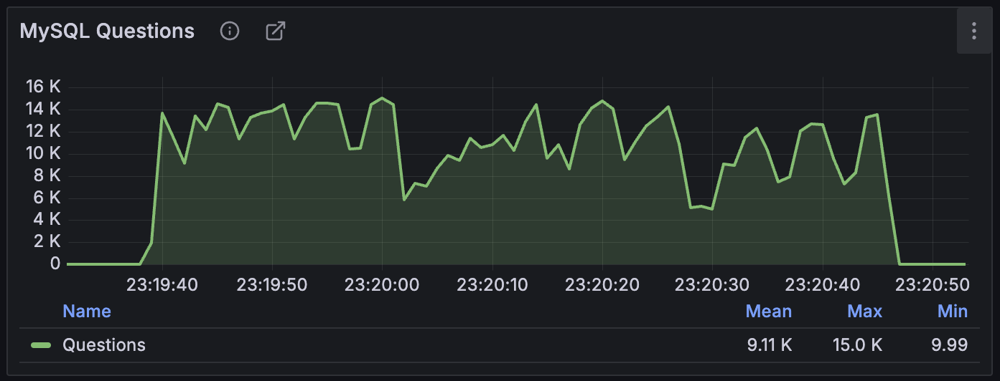
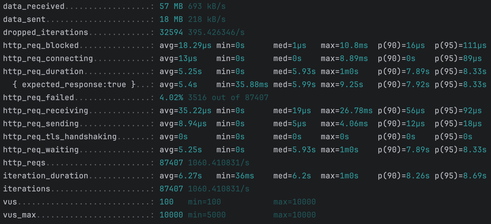

# 대기열 관리 설계 변경 보고서

## 1. 배경

콘서트 예약 시스템에서 대기열을 관리하는 방식은 사용자 경험과 성능을 개선하기 위해 최적의 설계가 필요합니다.  
기존 방식에서는 최초 토큰 발급 API를 폴링하여 토큰의 활성 여부를 확인하는 방식이었으나, Redis 기반의 대기열 관리 시스템을 도입하면서 새로운 설계 방식이 요구되었습니다.

## 2. 문제제기

기존 관리 방식 그대로 Redis를 도입하기에는 다음과 같은 문제가 있었습니다:

- **대기열 관리의 어려움**: Redis를 사용하면서 대기 큐와 활성 큐가 분리되어, 사용자 별 토큰이 상태에 따라 달라지면 토큰을 추적하기 어려워집니다. 따라서 기존 방식대로 폴링을 수행하면 토큰의 활성 여부를
  추적하기 어렵습니다.
- **상태 관리의 복잡성**: 대기 큐와 활성 큐가 분리되어 토큰이 상태를 가지지 않게 변경한다면, Queue 도메인이 상태를 가지는 것이 구현의 복잡도를 증가시킵니다.
- **성능 문제**: 기존의 "최대 활성화 토큰 개수 제한" 방식을 사용하기 위해서는 활성 토큰의 개수를 계속 조회해야 하는데, 활성 토큰 만료 시간 설정을 위해 Redis의 string 자료 구조를 사용하게 되면
  활성 토큰의 개수를 조회하는 비용이 크게 증가합니다.

## 3. 토큰 활성화 확인까지의 기존 방식 (As-Is)

1. 최초에 "대기열 토큰 발급 API"를 통해 토큰을 발급.
2. 이후 동일 API를 폴링하여 토큰이 ACTIVE 상태가 되었는지 확인.
3. ACTIVE 상태가 되면 해당 토큰을 사용하여 콘서트 조회 등 이후 프로세스를 진행.

## 4. 토큰 활성화 확인까지의 개선 방식 (To-Be)

### 주요 변경 사항

1. **대기열 토큰 대기 순위 조회 API 추가**:
    - 기존에는 토큰의 활성 상태만 확인했으나, 이제는 "대기열 토큰 대기 순위 조회" API를 통해 현재 순위 및 활성 여부를 확인함.
    - 사용자는 해당 API를 폴링하여 대기 상태를 지속적으로 확인하고, 활성화가 되면 이후 프로세스를 진행.

2. **Queue 도메인의 상태값 제거**:
    - 기존에는 Queue 도메인이 상태값을 가졌으나, 이는 Redis로 변경되면서 구현의 복잡도를 증가시킴.
    - 상태값을 제거하여 관리의 단순화를 도모.

3. **토큰 구조 변경**:
    - 기존 방식에서는 토큰과 사용자 매핑 시 DB를 직접적으로 조회함.
    - 개선된 방식에서는 "사용자 UUID | 랜덤 토큰값"의 형태로 저장하여 필요한 경우 UUID를 파싱하여 사용.
        - 현업에서의 토큰은 사용자의 고유 키를 가지고 있을 가능성이 높습니다. 해당 과제에서는 간소화하기 위해 토큰을 사용자의 UUID와 랜덤 토큰값을 "|"라는 구분자를 사용하여 간단하게 구성하였고,
          따라서 사용자 UUID가 필요할 때에는 토큰에서 UUID를 파싱하여 사용합니다.

4. **Redis Sorted Set 기반의 대기 큐 운영**:
    - 대기 큐는 Redis의 Sorted Set 자료구조를 사용하여 정렬.
    - 우선순위는 토큰의 발급 시간을 기준으로 설정.
    - 정해진 시간 간격마다 가장 오래된 토큰을 정해진 개수만큼 활성 큐로 이동.

5. **Redis TTL 기반 활성 토큰 만료 관리**:
    - 각각의 토큰이 고유한 만료 시간을 가지도록 Redis의 TTL을 활용.
    - 사용자별 UUID를 key 값으로 관리하여 Queue 도메인에서 직접 만료 시간을 관리할 필요 없음.
    - 이를 통해 복잡도를 크게 감소시킴.

## 5. 기존 방식과 개선 방식 비교 분석

| 항목        | 기존 방식 (As-Is)     | 개선 방식 (To-Be)       |
|-----------|-------------------|---------------------|
| 토큰 활성화 확인 | 토큰 발급 API 폴링      | 대기 순위 조회 API 폴링     |
| 상태 관리     | Queue 도메인이 상태를 가짐 | 상태값 제거              |
| 사용자 정보 관리 | 토큰-사용자 직접 매핑      | 토큰에서 사용자 UUID 파싱    |
| 대기 큐 관리   | 단순 리스트            | Redis Sorted Set 기반 |
| 활성화 방식    | 최대 활성화 개수 제한      | 일정 간격마다 일정 개수 활성화   |
| 토큰 만료 관리  | Queue 도메인에서 직접 관리 | Redis TTL 기반 관리     |

## 6. 한계점

- **폴링 방식의 한계**: 기존 방식과 마찬가지로 사용자는 주기적으로 "대기열 토큰 대기 순위 조회 API"를 호출해야 합니다.
- **Redis 의존성 증가**: Redis를 활용한 구조로 변경되면서 Redis 장애 시 시스템에 미치는 영향이 커질 수 있습니다.

## 7. 활성 토큰 개수 산출

기존 "최대 활성화 토큰 개수 제한" 방식에서 "정해진 시간 간격마다 정해진 개수만큼 토큰 활성화" 방식으로 변경됨에 따라 시스템에서 안정적으로 트래픽을 받아낼 수 있는 활성화 개수를 산출하였습니다.

### 7.1 부하 테스트

DB가 가장 시스템의 병목일 것이라고 판단하고, DB 부하 테스트를 진행하였습니다.

테스트 환경은 다음과 같습니다:

- **DB 환경**: MySQL 8.0
    - CPU 제한: 1 vCPU
    - 메모리 제한: 1024MB
- **캐시 환경**: Redis
    - CPU 제한: 1 vCPU
    - 메모리 제한: 1024MB
- **API 요청 환경**:
    - 초당 2000개의 요청 (RPS 2000)
    - 1분 동안 지속적 부하 테스트
    - 최대 가용 Virtual Users (VUs): 10,000
- **테스트 대상 API**:
    - 캐시 적용 X API: (`/api/v1/concerts?page=1&size=10`)

### 7.2. 부하 테스트 결과




- 부하 테스트 결과, DB에 직접 요청하는 API의 최대 QPS는 15K, API 요청 실패율은 4.02%로 확인되었습니다.
- 따라서 안정적인 운영을 위해 최대 QPS를 10K 이하로 유지하는 것으로 결정하였습니다.
- 활성화 주기가 10초이므로, 활성화할 토큰 개수는 아래와 같이 계산해 보았습니다.
  ```
  10,000(QPS)
  ÷ 3(API 당 호출 쿼리 수 평균)
  ÷ 5(사용자가 요청하는 API 개수)
  ÷ 1.5(재시도 계수)
  × 10(초)
  ≈ 4444
  ```

따라서, 시스템의 안정적인 운영을 위해 조금 더 보수적으로 접근하여 **10초마다 약 4,000개의 토큰을 활성화하는 것이 적절**할 것으로 판단하였습니다.

## 8. 결론

- 기존 방식의 문제점을 해결하기 위해 Redis 기반의 대기열 관리 방식을 도입하였습니다.
- "대기열 토큰 대기 순위 조회 API"를 추가하여 사용자가 대기열에서의 자신의 위치와 활성 여부를 조회할 수 있도록 개선하였습니다.
- Queue 도메인의 상태값을 제거하여 복잡도를 줄였습니다.
- Redis Sorted Set과 TTL을 활용하여 대기 큐와 활성 토큰 만료를 효율적으로 관리하였습니다.
- 활성 토큰 개수를 동적으로 조정하여 안정적인 시스템 운영이 가능하도록 설계 변경을 완료하였습니다.