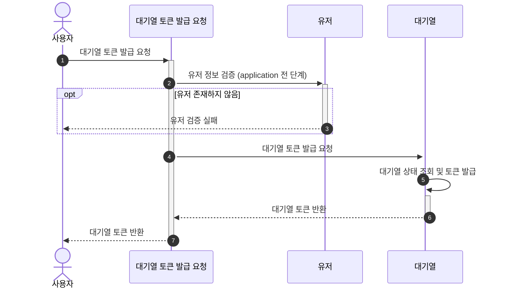
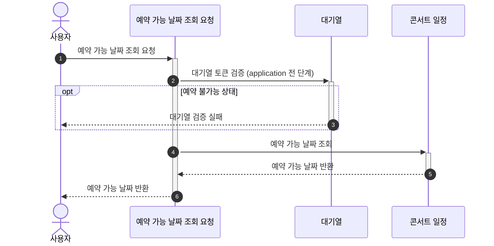
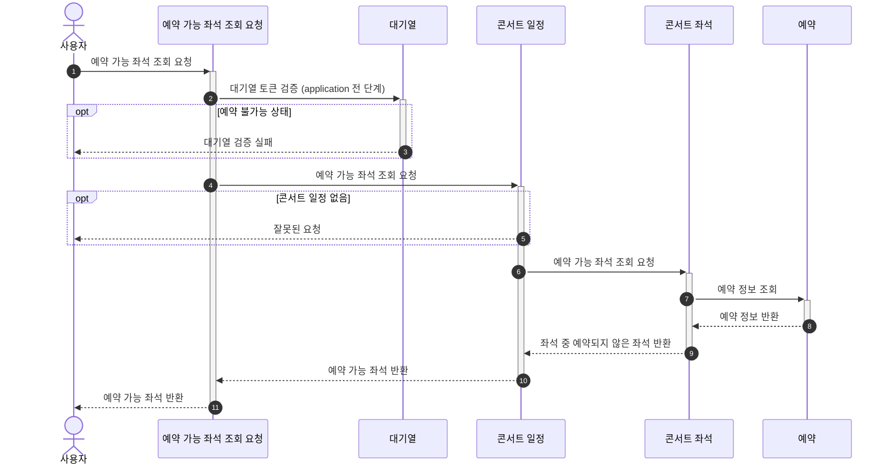
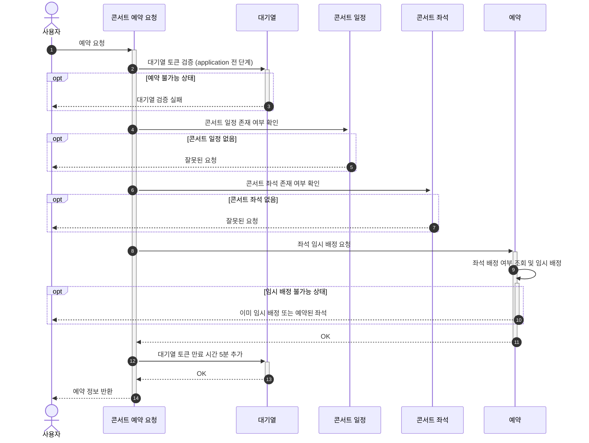
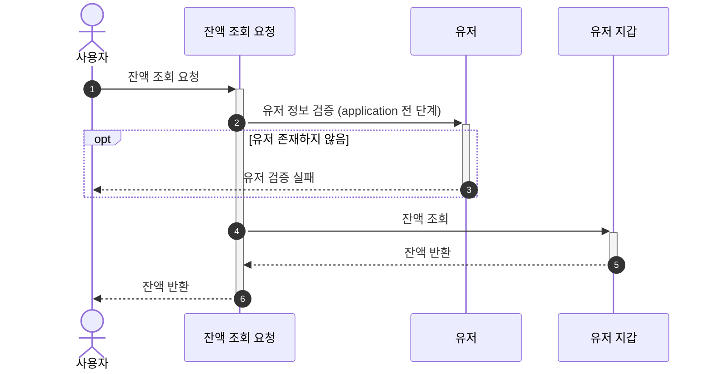
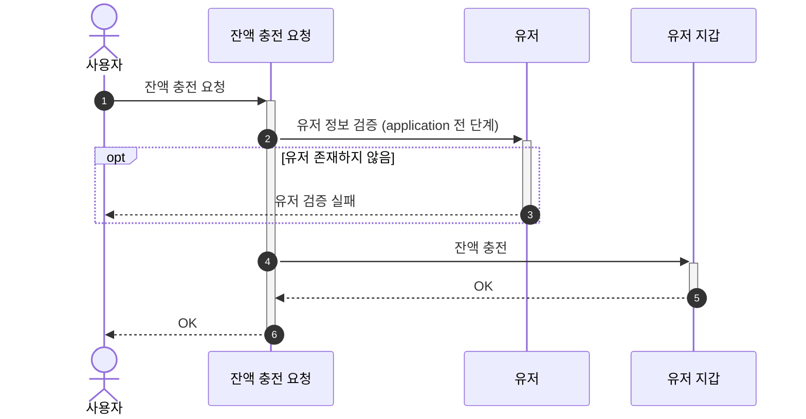
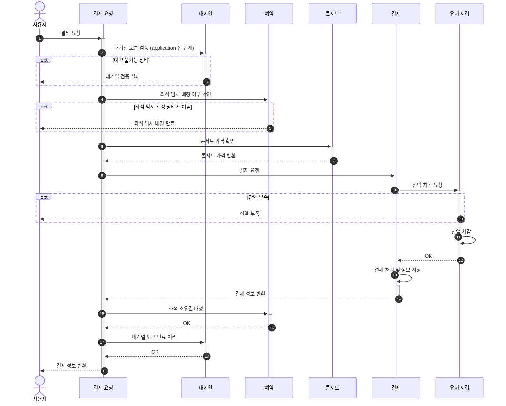

# 시퀀스 다이어그램

- 최초 사용자가 진입하는 ~~요청 블록은 application의 행동을 기준으로 작성되었습니다. (Facade)
- 이후 블록은 각 domain의 행동을 기준으로 작성되었습니다. (Service / Model)
- 대기열 토큰 검증 / 유저 정보 검증은 추후 공통화로 application 레이어 진입 전 단계에서 이루어질 수 있습니다.

## 대기열 토큰 발급

## 예약 가능 날짜 조회

## 예약 가능 좌석 조회

## 좌석 예약 요청

## 잔액 조회

## 잔액 충전

## 결제

