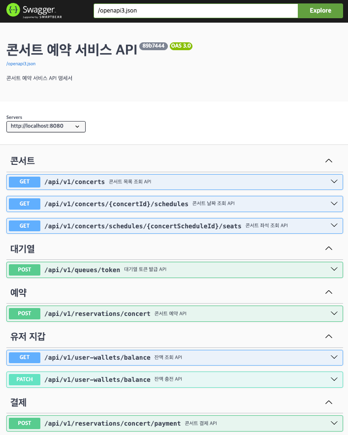

# Swagger

## 개요

- RestDocs 기반으로 Controller 테스트 작성 후, OpenAPI 3.0 기반의 JSON을 추출하여 Swagger에 Import합니다.
- 배포 환경에서는 빌드 시 자동 Import 로직이 적용되어 있습니다.

## 로컬 테스트 방법

1. 터미널에서 아래 명령어 실행
    ```shell
    ./gradlew openapi3
    ```
2. Application 실행
3. http://localhost:8080/swagger-ui/index.html 접속

## 외부 확인용 Swagger Hub

- https://app.swaggerhub.com/apis-docs/psh10066/hhplus-server-concert/e48f4d9#/

## 캡처 화면

